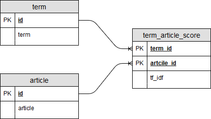

# esa_db

This is a SQLite database containing an index that can be used for explicit semantic analysis [https://en.wikipedia.org/wiki/Explicit_semantic_analysis]. The index was generated from a Wikipedia dump in April 2019.

**The database dump (esa.db) can be downloaded at: [https://uni-duisburg-essen.sciebo.de/s/kYNVLdrE7KycpSJ]**

## DB structure



**terms** contains all the terms and their corresponding indexes. **Note** Terms are stemmed using Porter stemming.
**articles** contains all Wikipedia articles and ids.
**term_article_score** gives for each term-article pair the corresponding tf_idf score of the term for that article.

### Useful SQL statements

**Querying the ESA vectors for single (stemmed) term**

```SQL
SELECT a.article, s.tf_idf
  FROM terms t, term_article_score s, articles a
  WHERE t.term = 'physic' 
  AND t.id = s.term_id AND a.id = s.article_id
  ORDER BY s.tf_idf DESC;
```

**Term disambiguation**

```SQL
SELECT a.article, sum(s.tf_idf) as 'score' 
  FROM terms t, term_article_score s, articles a  
   WHERE t.term in ('jupit', 'venus', 'mars', 'saturn', 'mytholog') 
   AND t.id = s.term_id AND a.id = s.article_id 
   GROUP BY a.article 
   ORDER BY score 
   DESC LIMIT 10;
```


## Database access

### From command line
1. Download the appropriate prebuild binary sqlite-tools-... for your platform.
2. Unzip everything into a new folder, e.g. sqlite
3. Open a console and navigate to the sqlite folder. 

The esa database dump from above can be accesses by the command *sqlite3 path/to/the/file/esa.db*

### From R
Install the lates RSQLite and DBI (database interface) package (if not already installed). 
```R
install.packages(c("DBI", "RSQLite"))
```

Connect to the database
```R
require(DBI)
require(tm) # Use, for example, the text mining (tm) package for preprocessing.

con <- dbConnect(RSQLite::SQLite(), "path/to/the/file/esa.db") # setup database connection

query_terms <- stemDocument(c("physics", "nobel"))
query <- paste0("SELECT a.article, s.tf_idf
  FROM terms t, term_article_score s, articles a
  WHERE t.term in (", 
    paste0("'", query_terms, "'", collapse=","), 
  ")  
  AND t.id = s.term_id AND a.id = s.article_id
  ORDER BY s.tf_idf DESC;"
  
results <- dbGetQuery(con, query)

dbDisconnect(con)

...
```

### From python
The SQLlite library comes with recent Python distributions by default.

Connect to the database
```python
import sqlite3 as sql

con = sql.connect(db_path)

stemmer = nltk.stem.SnowballStemmer(language=lang)
query_terms = [stemmer.stem(token) for token in ["physics", "nobel"]]

"""SELECT terms.term, articles.article, tf_idf
 FROM terms, term_article_score, articles
 WHERE terms.term in ({}) 
 AND terms.id = term_article_score.term_id AND articles.id = term_article_score.article_id
 ORDER BY tf_idf DESC;
""".format(param_placeholders)
c = con.cursor()
results = c.execute(statement, query_terms)

...
```
